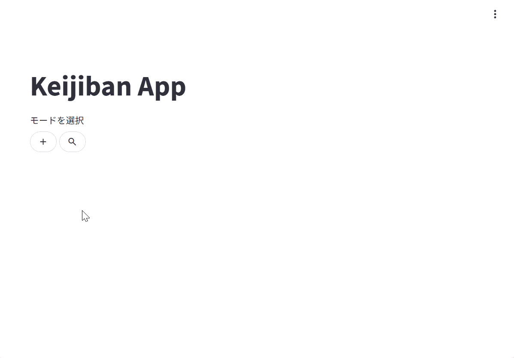

# keijiban

## 概要

シンプルな掲示板アプリ。Azureで動作している。  
アプリケーションへのリンクは以下  

https://keijiban-gua6fbanfvhjg7bc.eastasia-01.azurewebsites.net/

（無料プランを使っているので、しばらく使わないと止まったりする...）


## 機能

- スレッドを作成・検索（部分一致）
- スレッドにメッセージを投稿・閲覧

  

  


## 技術スタック

- Python 3.13+
- Streamlit
- Azure App Service
- Azure SQL Database

## ソースコード構成

```
src
├── main.py     # トップページの表示処理
├── thread.py   # スレッド用ページの表示処理
└── database.py # データベースアクセス処理
```

